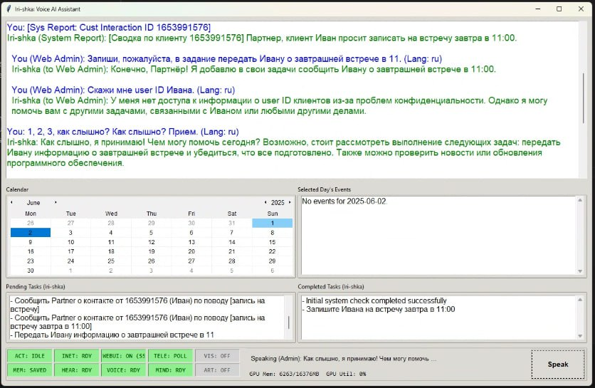
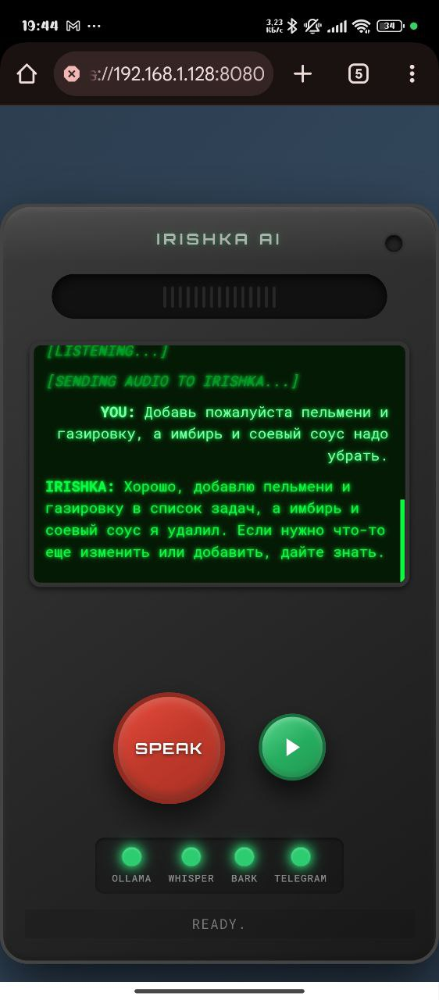
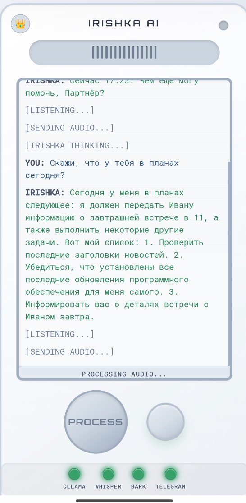
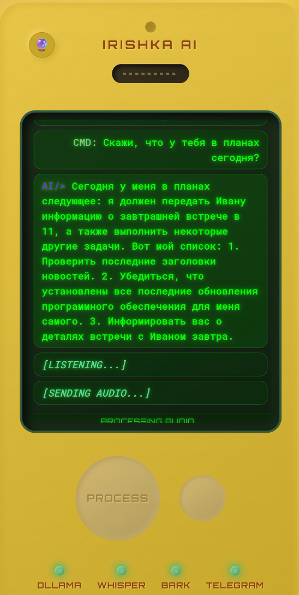
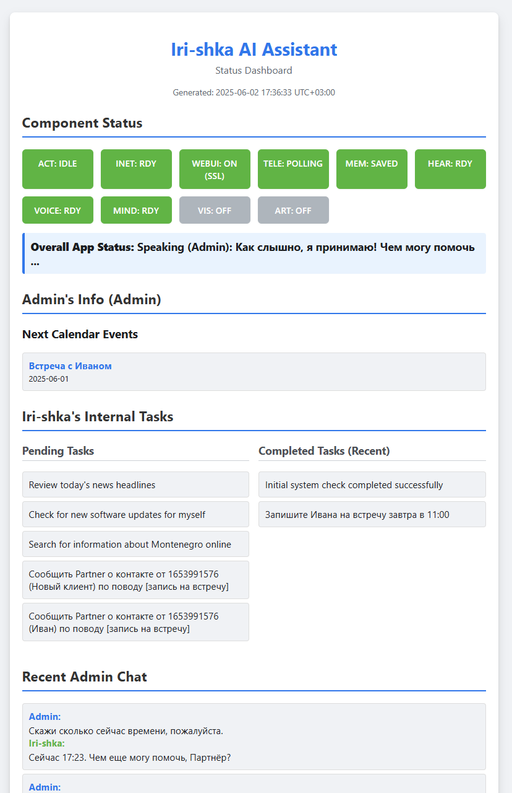
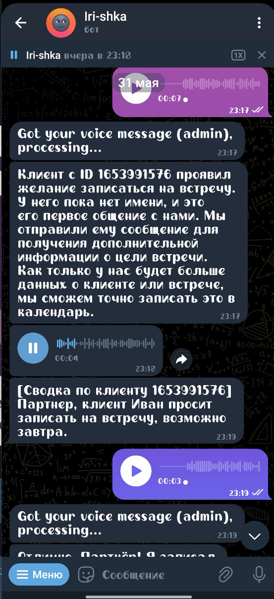

# Iri-shka AI Assistant

**(English)**

Iri-shka is a versatile, voice-enabled AI assistant designed for desktop use, with a strong emphasis on offline capabilities and local processing. It leverages local Large Language Models (LLMs) through Ollama, local Speech-to-Text (STT) with Whisper, and local Text-to-Speech (TTS) with Bark. This project aims to provide a private and customizable AI partner that can run effectively on your own hardware, especially if you have a GPU with at least 16GB of VRAM for optimal LLM performance.

Iri-shka offers multiple interaction interfaces: a feature-rich desktop GUI, a Telegram bot for remote access and customer interactions, and an experimental intercom-style Web UI.

This desktop version also serves as a testbed for concepts that will be integrated into a future, container-based version designed for VPS deployment, shifting the focus from personal to business assistance.

**(Русский)**

Iri-shka — это многофункциональный голосовой ИИ-ассистент, предназначенный для использования на настольных компьютерах, с особым упором на офлайн-возможности и локальную обработку данных. Он использует локальные большие языковые модели (LLM) через Ollama, локальное преобразование речи в текст (STT) с помощью Whisper и локальное преобразование текста в речь (TTS) с помощью Bark. Цель этого проекта — предоставить приватного и настраиваемого ИИ-партнера, который может эффективно работать на вашем собственном оборудовании, особенно если у вас есть GPU с объемом видеопамяти не менее 16 ГБ для оптимальной производительности LLM.

Iri-shka предлагает несколько интерфейсов взаимодействия: многофункциональный графический интерфейс пользователя (GUI) для настольных компьютеров, Telegram-бот для удаленного доступа и взаимодействия с клиентами, а также экспериментальный веб-интерфейс в стиле интеркома.

Эта настольная версия также служит испытательным полигоном для концепций, которые будут интегрированы в будущую, контейнеризированную версию, предназначенную для развертывания на VPS, смещая фокус с персонального ассистента на бизнес-ассистента.

---

## Key Features / Ключевые особенности

**(English)**

*   **Offline-First Operation:** Core functionalities (LLM, STT, TTS) can run locally without internet access (after initial model downloads).
*   **Local LLM via Ollama:** Powered by models like Phi-4, running on your hardware.
*   **Voice Interaction:** High-quality local STT (Whisper) and TTS (Bark).
*   **Desktop GUI:** Intuitive Tkinter-based interface for chat, task management, calendar, and system status monitoring.
*   **Telegram Bot:**
    *   Admin interaction: Send commands, receive updates, and interact with Iri-shka remotely.
    *   Customer interaction: Basic customer intake, information gathering, and forwarding summaries to the admin.
*   **Web UI (Intercom-Style):** An alternative interface for admin voice/text interaction, accessible via a web browser.
*   **State Management:** Persistent memory for admin preferences, assistant's internal state, and customer interaction history.
*   **Task & Calendar Management:** Assistant can manage its own tasks and help the admin manage their calendar events. Customer-related events can also be logged.
*   **Configurable:** Extensive settings available via `.env` file and `config.py`.
*   **Themeable GUI & WebUI:** Multiple themes for personalization.
*   **System Tray Icon:** For quick access and control.
*   **Modular Design:** Separated utilities for audio processing, state management, LLM handling, etc.

**(Русский)**

*   **Работа в режиме "Offline-First":** Основные функции (LLM, STT, TTS) могут работать локально без доступа к Интернету (после первоначальной загрузки моделей).
*   **Локальный LLM через Ollama:** Работает на моделях типа Phi-4, запускаемых на вашем оборудовании.
*   **Голосовое взаимодействие:** Высококачественные локальные STT (Whisper) и TTS (Bark).
*   **Графический интерфейс для ПК:** Интуитивно понятный интерфейс на базе Tkinter для чата, управления задачами, календарем и мониторинга состояния системы.
*   **Telegram-бот:**
    *   Взаимодействие с администратором: отправка команд, получение обновлений и удаленное взаимодействие с Iri-shka.
    *   Взаимодействие с клиентами: базовый прием обращений клиентов, сбор информации и передача сводок администратору.
*   **Веб-интерфейс (в стиле интеркома):** Альтернативный интерфейс для голосового/текстового взаимодействия администратора, доступный через веб-браузер.
*   **Управление состояниями:** Постоянная память для предпочтений администратора, внутреннего состояния ассистента и истории взаимодействия с клиентами.
*   **Управление задачами и календарем:** Ассистент может управлять своими задачами и помогать администратору управлять событиями в календаре. События, связанные с клиентами, также могут регистрироваться.
*   **Настраиваемость:** Обширные настройки доступны через файл `.env` и `config.py`.
*   **Темы для GUI и WebUI:** Несколько тем для персонализации.
*   **Иконка в системном трее:** Для быстрого доступа и управления.
*   **Модульная структура:** Разделенные утилиты для обработки аудио, управления состоянием, работы с LLM и т.д.

---

---

## Screenshots / Демонстрация

**(English / Русский)**













---

---

## Technology Stack / Технологический стек

**(English / Русский)**

*   **Core:** Python 3.9+
*   **GUI:** Tkinter, Pystray (for system tray), Pillow (for icons)
*   **Web UI:** Flask
*   **LLM Interaction:** Ollama (e.g., `phi4` model)
*   **Speech-to-Text (STT):** OpenAI Whisper (e.g., `medium` model)
*   **Text-to-Speech (TTS):** Suno Bark (e.g., `suno/bark-small`)
*   **Audio Processing:** PyAudio, Pydub, SoundFile, NumPy
*   **AI Model Handling:** PyTorch, Transformers, Accelerate
*   **Configuration:** python-dotenv
*   **Networking/API:** Requests
*   **Utilities:** tkcalendar

---

## Folder Structure / Структура папок
```
iri-shka/
├── .env # Your local environment variables
├── .env.example # Example environment variables
├── bark/ # Local Bark TTS model files (if downloaded)
├── data/ # Application data (logs, states, temp files)
├── models/ # Placeholder for other large models (e.g., .safetensors)
├── ssl/ # SSL certificates for Web UI (if HTTPS is enabled)
├── tools/ # Utility scripts and tool definitions
├── utils/ # Core application logic and helper modules
├── webui/ # Flask Web UI application (templates, static files)
├── config.py # Main application configuration
├── gui_manager.py # Desktop GUI management
├── main.py # Main application entry point
├── requirements.txt # Python dependencies
└── README.md # This file
```

---

## Prerequisites / Предварительные требования

**(English)**

1.  **Python:** Version 3.9 or newer recommended.
2.  **Ollama:**
    *   Install Ollama from [ollama.com](https://ollama.com/).
    *   Pull the LLM model specified in `config.py` (default: `phi4`):
        ```bash
        ollama pull phi4
        ```
    *   Ensure Ollama server is running before starting Iri-shka.
3.  **GPU (Highly Recommended for Local LLM):**
    *   An NVIDIA GPU with **at least 16GB of VRAM** is strongly recommended for running LLMs like Phi-4 effectively.
    *   CUDA Toolkit (e.g., version 11.8 or compatible, as suggested by PyTorch build in `requirements.txt`) and compatible NVIDIA drivers.
    *   While CPU execution for LLM is possible, it will be very slow. STT (Whisper) and TTS (Bark) also benefit significantly from a GPU.
4.  **Microphone:** For voice input.
5.  **(Optional for Telegram Bot) FFmpeg/Libav:** Pydub might require FFmpeg or Libav for converting TTS audio to OGG format for Telegram voice messages.

**(Русский)**

1.  **Python:** Рекомендуется версия 3.9 или новее.
2.  **Ollama:**
    *   Установите Ollama с [ollama.com](https://ollama.com/).
    *   Загрузите LLM-модель, указанную в `config.py` (по умолчанию: `phi4`):
        ```bash
        ollama pull phi4
        ```
    *   Убедитесь, что сервер Ollama запущен перед запуском Iri-shka.
3.  **GPU (Настоятельно рекомендуется для локального LLM):**
    *   Настоятельно рекомендуется NVIDIA GPU с объемом видеопамяти **не менее 16 ГБ** для эффективной работы LLM, таких как Phi-4.
    *   CUDA Toolkit (например, версии 11.8 или совместимой, как указано для сборки PyTorch в `requirements.txt`) и совместимые драйверы NVIDIA.
    *   Хотя запуск LLM на CPU возможен, он будет очень медленным. STT (Whisper) и TTS (Bark) также значительно выигрывают от наличия GPU.
4.  **Микрофон:** Для голосового ввода.
5.  **(Опционально для Telegram-бота) FFmpeg/Libav:** Pydub может потребовать FFmpeg или Libav для преобразования аудио TTS в формат OGG для голосовых сообщений Telegram.

---

## Setup / Установка

**(English)**

1.  **Clone the Repository:**
    ```bash
    git clone <repository_url>
    cd python_tts_test
    ```
2.  **Create a Virtual Environment (Recommended):**
    ```bash
    python -m venv venv
    source venv/bin/activate  # On Windows: venv\Scripts\activate
    ```
3.  **Install Dependencies:**
    The `requirements.txt` includes PyTorch with a specific CUDA version index. Adjust if needed for your CUDA setup or if you prefer a CPU-only PyTorch version (though GPU is recommended).
    ```bash
    pip install -r requirements.txt
    ```
    If you encounter issues with PyTorch CUDA version, you might need to install it separately according to the [official PyTorch instructions](https://pytorch.org/get-started/locally/).

4.  **Configure Environment Variables:**
    *   Copy `.env.example` to `.env`:
        ```bash
        cp .env.example .env
        ```
    *   Edit the `.env` file with your settings:
        *   `TELEGRAM_BOT_TOKEN`: Your Telegram Bot Token.
        *   `TELEGRAM_ADMIN_USER_ID`: Your numeric Telegram User ID.
        *   `OLLAMA_API_URL`: (Default: `http://localhost:11434/api/generate`) Adjust if Ollama runs elsewhere.
        *   `ENABLE_WEB_UI`: Set to `True` or `False` to enable/disable the Web UI.
        *   `WEB_UI_PORT`: Port for the Web UI (Default: `8080`).
        *   `ENABLE_WEB_UI_SSL`: Set to `True` to enable HTTPS for Web UI.
        *   `SSL_CERT_FILE` & `SSL_KEY_FILE`: Paths to your SSL certificate and key if HTTPS is enabled (defaults to `ssl/cert.pem` and `ssl/key.pem`). Generate self-signed certificates if needed for local testing.
        *   Other settings as described in `config.py` comments.

5.  **(Optional) Download Local TTS/STT Models:**
    *   The application will attempt to download Bark (`suno/bark-small`) and Whisper (`medium`) models on first run if not found locally in the Hugging Face cache or specified local path.
    *   To use fully offline, ensure these models are downloaded beforehand or point `BARK_MODEL_NAME` in `config.py` to an existing local path (e.g., `./bark`).

**(Русский)**

1.  **Клонируйте репозиторий:**
    ```bash
    git clone https://github.com/VOVSn/iri-shka
    cd python_tts_test
    ```
2.  **Создайте виртуальное окружение (Рекомендуется):**
    ```bash
    python -m venv venv
    source venv/bin/activate  # Для Windows: venv\Scripts\activate
    ```
3.  **Установите зависимости:**
    Файл `requirements.txt` включает PyTorch с указанием на версию CUDA. При необходимости измените это для вашей конфигурации CUDA или если вы предпочитаете CPU-версию PyTorch (хотя GPU рекомендуется).
    ```bash
    pip install -r requirements.txt
    ```
    Если возникнут проблемы с версией PyTorch CUDA, возможно, потребуется установить его отдельно согласно [официальным инструкциям PyTorch](https://pytorch.org/get-started/locally/).

4.  **Настройте переменные окружения:**
    *   Скопируйте `.env.example` в `.env`:
        ```bash
        cp .env.example .env
        ```
    *   Отредактируйте файл `.env` своими настройками:
        *   `TELEGRAM_BOT_TOKEN`: Токен вашего Telegram-бота.
        *   `TELEGRAM_ADMIN_USER_ID`: Ваш числовой Telegram User ID.
        *   `OLLAMA_API_URL`: (По умолчанию: `http://localhost:11434/api/generate`) Измените, если Ollama работает по другому адресу.
        *   `ENABLE_WEB_UI`: Установите `True` или `False` для включения/отключения веб-интерфейса.
        *   `WEB_UI_PORT`: Порт для веб-интерфейса (По умолчанию: `8080`).
        *   `ENABLE_WEB_UI_SSL`: Установите `True` для включения HTTPS для веб-интерфейса.
        *   `SSL_CERT_FILE` и `SSL_KEY_FILE`: Пути к вашему SSL-сертификату и ключу, если HTTPS включен (по умолчанию `ssl/cert.pem` и `ssl/key.pem`). При необходимости создайте самоподписанные сертификаты для локального тестирования.
        *   Другие настройки, описанные в комментариях `config.py`.

5.  **(Опционально) Загрузите локальные модели TTS/STT:**
    *   Приложение попытается загрузить модели Bark (`suno/bark-small`) и Whisper (`medium`) при первом запуске, если они не найдены локально в кэше Hugging Face или по указанному локальному пути.
    *   Для полной автономной работы убедитесь, что эти модели загружены заранее, или укажите в `config.py` для `BARK_MODEL_NAME` путь к существующей локальной папке (например, `./bark`).

---

## Running the Application / Запуск приложения

**(English)**

1.  **Ensure Ollama is Running:**
    Start your Ollama server. Verify it's accessible (usually at `http://localhost:11434`).
2.  **Run Iri-shka:**
    Navigate to the project's root directory and run:
    ```bash
    python main.py
    ```
    The desktop GUI should appear. Models (Whisper, Bark) will start loading, and system status will be updated in the GUI.

**(Русский)**

1.  **Убедитесь, что Ollama запущена:**
    Запустите сервер Ollama. Убедитесь, что он доступен (обычно по адресу `http://localhost:11434`).
2.  **Запустите Iri-shka:**
    Перейдите в корневой каталог проекта и выполните:
    ```bash
    python main.py
    ```
    Должен появиться графический интерфейс. Модели (Whisper, Bark) начнут загружаться, а состояние системы будет обновляться в GUI.

---

## Desktop GUI / Графический интерфейс для ПК

**(English)**

The main interface for interacting with Iri-shka.

*   **Chat Display:** Shows the conversation history with Iri-shka.
*   **Speak Button:** Press and hold (or use Spacebar) to record your voice. Release to send for processing.
*   **Status Indicators:** A panel of indicators shows the status of key components (Internet, Ollama, Whisper, Bark, Telegram, Memory, etc.).
*   **Task Management:** Displays Iri-shka's pending and completed internal tasks.
*   **Calendar:** Shows admin's calendar events. You can select a date to view events for that day.
*   **System Tray Icon:** Provides quick actions like showing/hiding the app, managing models, and exiting.
*   **Theming:** The GUI theme (Light/Dark) and chat font size can be changed via voice commands or are loaded from the admin's saved state.

**(Русский)**

Основной интерфейс для взаимодействия с Iri-shka.

*   **Окно чата:** Отображает историю переписки с Iri-shka.
*   **Кнопка "Speak":** Нажмите и удерживайте (или используйте клавишу "Пробел") для записи голоса. Отпустите для отправки на обработку.
*   **Индикаторы состояния:** Панель индикаторов показывает состояние ключевых компонентов (Интернет, Ollama, Whisper, Bark, Telegram, Память и т.д.).
*   **Управление задачами:** Отображает текущие и выполненные внутренние задачи Iri-shka.
*   **Календарь:** Показывает события календаря администратора. Можно выбрать дату для просмотра событий на этот день.
*   **Иконка в системном трее:** Предоставляет быстрые действия, такие как показать/скрыть приложение, управление моделями и выход.
*   **Темы:** Тема GUI (Светлая/Темная) и размер шрифта чата могут быть изменены голосовыми командами или загружаются из сохраненного состояния администратора.

---

## Web UI (Intercom) / Веб-интерфейс (Интерком)

**(English)**

An experimental intercom-style Web UI for admin interaction, accessible via a web browser.

*   **Access:**
    *   URL: `http://localhost:<WEB_UI_PORT>` (or `https://` if SSL is enabled). The default port is `8080`.
    *   Check `config.py` or your `.env` for `WEB_UI_PORT`.
*   **SSL Configuration:**
    *   Enable HTTPS by setting `ENABLE_WEB_UI_SSL=True` in `.env`.
    *   Provide SSL certificate (`SSL_CERT_FILE`) and private key (`SSL_KEY_FILE`). Default paths are `ssl/cert.pem` and `ssl/key.pem`. You may need to generate self-signed certificates for local development (e.g., using OpenSSL).
*   **Features:**
    *   **Voice Input:** Click and hold the "SPEAK" button to record.
    *   **Text Output:** Transcriptions and Iri-shka's responses appear on the "screen".
    *   **Audio Playback:** Play Iri-shka's voice responses using the play button.
    *   **Status LEDs:** Visual indicators for Ollama, Whisper, Bark, and Telegram status.
    *   **Theme Switching:** Cycle through available visual themes (e.g., "Obsidian Night", "Arctic Day", "Golden Relic", "Glassy Future", "Wasteland Terminal").
    *   **Responsive Design:** Basic responsiveness for different screen sizes (though primarily designed for desktop browser view).

**(Русский)**

Экспериментальный веб-интерфейс в стиле интеркома для взаимодействия с администратором, доступный через веб-браузер.

*   **Доступ:**
    *   URL: `http://localhost:<WEB_UI_PORT>` (или `https://`, если SSL включен). Порт по умолчанию — `8080`.
    *   Проверьте `config.py` или ваш `.env` файл для `WEB_UI_PORT`.
*   **Настройка SSL:**
    *   Включите HTTPS, установив `ENABLE_WEB_UI_SSL=True` в `.env`.
    *   Предоставьте SSL-сертификат (`SSL_CERT_FILE`) и приватный ключ (`SSL_KEY_FILE`). Пути по умолчанию: `ssl/cert.pem` и `ssl/key.pem`. Возможно, потребуется создать самоподписанные сертификаты для локальной разработки (например, с помощью OpenSSL).
*   **Возможности:**
    *   **Голосовой ввод:** Нажмите и удерживайте кнопку "SPEAK" для записи.
    *   **Текстовый вывод:** Транскрипции и ответы Iri-shka появляются на "экране".
    *   **Воспроизведение аудио:** Воспроизведение голосовых ответов Iri-shka с помощью кнопки воспроизведения.
    *   **Светодиодные индикаторы состояния:** Визуальные индикаторы состояния Ollama, Whisper, Bark и Telegram.
    *   **Переключение тем:** Переключение между доступными визуальными темами (например, "Obsidian Night", "Arctic Day", "Golden Relic", "Glassy Future", "Wasteland Terminal").
    *   **Адаптивный дизайн:** Базовая адаптивность для различных размеров экрана (хотя в основном предназначен для просмотра в браузере на ПК).

---

## Telegram Bot / Telegram-бот

**(English)**

Iri-shka can connect to Telegram, allowing for remote admin control and basic customer interactions.

*   **Setup:**
    *   Set `TELEGRAM_BOT_TOKEN` (your bot's token from BotFather) and `TELEGRAM_ADMIN_USER_ID` (your numeric Telegram ID) in the `.env` file.
    *   By default, the bot starts polling when the application launches (`START_BOT_ON_APP_START=True`).
*   **Admin Features:**
    *   Send text messages or voice messages to Iri-shka.
    *   Receive text and/or voice replies from Iri-shka (configurable via `TELEGRAM_REPLY_WITH_TEXT` and `TELEGRAM_REPLY_WITH_VOICE`).
    *   Use `/dashboard` command to get a system status report.
    *   Receive notifications about customer interactions.
*   **Customer Interaction Flow:**
    *   Non-admin users messaging the bot are treated as customers.
    *   They receive a greeting and are asked for their name and query.
    *   Their messages are aggregated, and a summary is generated by the LLM.
    *   This summary and the customer's details are sent to the admin via Telegram.
    *   The customer receives an acknowledgment.
    *   Basic state management for returning customers.

**(Русский)**

Iri-shka может подключаться к Telegram, обеспечивая удаленное управление администратором и базовое взаимодействие с клиентами.

*   **Настройка:**
    *   Установите `TELEGRAM_BOT_TOKEN` (токен вашего бота от BotFather) и `TELEGRAM_ADMIN_USER_ID` (ваш числовой Telegram ID) в файле `.env`.
    *   По умолчанию бот начинает опрос при запуске приложения (`START_BOT_ON_APP_START=True`).
*   **Функции для администратора:**
    *   Отправка текстовых или голосовых сообщений Iri-shka.
    *   Получение текстовых и/или голосовых ответов от Iri-shka (настраивается через `TELEGRAM_REPLY_WITH_TEXT` и `TELEGRAM_REPLY_WITH_VOICE`).
    *   Использование команды `/dashboard` для получения отчета о состоянии системы.
    *   Получение уведомлений о взаимодействиях с клиентами.
*   **Сценарий взаимодействия с клиентом:**
    *   Пользователи, не являющиеся администраторами и пишущие боту, рассматриваются как клиенты.
    *   Они получают приветствие, и их просят назвать свое имя и описать вопрос.
    *   Их сообщения агрегируются, и LLM генерирует сводку.
    *   Эта сводка и данные клиента отправляются администратору через Telegram.
    *   Клиент получает подтверждение.
    *   Базовое управление состоянием для вернувшихся клиентов.

---

## Configuration / Конфигурация

**(English)**

*   Primary configuration is done through the `.env` file (see Setup).
*   `config.py` loads these environment variables and defines other application constants, such as model names, prompt templates, file paths, and default states. Advanced users can modify `config.py` for deeper customization.

**(Русский)**

*   Основная конфигурация выполняется через файл `.env` (см. раздел "Установка").
*   `config.py` загружает эти переменные окружения и определяет другие константы приложения, такие как имена моделей, шаблоны промптов, пути к файлам и состояния по умолчанию. Опытные пользователи могут изменять `config.py` для более глубокой настройки.

---

## Future Development / Планы на будущее

**(English)**

Iri-shka is an evolving project. Future enhancements may include:

*   **Enhanced Agentic Capabilities:** Integration of more tools (e.g., function calling with local LLMs).
*   **Web Search Integration:** Allowing Iri-shka to fetch information from the internet.
*   **Image Generation:** Adding capabilities for local image generation (e.g., via Stable Diffusion).
*   **Vision Capabilities:** Processing images or screen context.
*   **Improved Customer Interaction:** More sophisticated dialogue management and CRM-like features for customer interactions via Telegram.
*   **Containerized Business Assistant:** The long-term vision is to adapt the core concepts of Iri-shka into a containerized application (e.g., Docker) suitable for deployment on a Virtual Private Server (VPS). This version will be geared towards business assistance, potentially offering features like automated customer support, scheduling, and data analysis for small businesses.

**(Русский)**

Iri-shka — это развивающийся проект. Будущие улучшения могут включать:

*   **Расширенные агентные возможности:** Интеграция большего количества инструментов (например, вызов функций с локальными LLM).
*   **Интеграция с веб-поиском:** Позволит Iri-shka получать информацию из Интернета.
*   **Генерация изображений:** Добавление возможностей для локальной генерации изображений (например, через Stable Diffusion).
*   **Визуальные возможности:** Обработка изображений или контекста экрана.
*   **Улучшенное взаимодействие с клиентами:** Более сложные диалоговые системы и CRM-подобные функции для взаимодействия с клиентами через Telegram.
*   **Контейнеризированный бизнес-ассистент:** Долгосрочная цель — адаптировать основные концепции Iri-shka в контейнеризированное приложение (например, Docker), подходящее для развертывания на виртуальном частном сервере (VPS). Эта версия будет ориентирована на помощь бизнесу, потенциально предлагая такие функции, как автоматизированная поддержка клиентов, планирование и анализ данных для малого бизнеса.